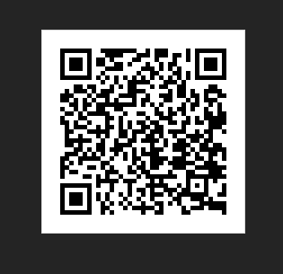

## myNatCatsTools
#### Load your python environment starting [here](./loadPythonEnv.md)

- For a Command Line Interface use:
   - [blockSearch](./blockSearch.py)
     - Functional
     - Time consuming(11 secs per query)
     - Uses web blockchain api
     - Command line based
- For a Graphic User Interface use:
   - [blockSearch_GUI](./blockSearch_GUI.py)
      - Functional
      - Time consuming(11 secs per query)
      - Uses web blockchain api
      - Graphic User Interface based
  - main_app, block_fetcher.py and block_fetcher2.py
    - Uses web blockchain api
    - Uses local node blockchain api (umbrel)
    - Graphic User Interface based

 

## For Node Configuration
### Start with enabling RPC and REST [here](./umbrelBitcoinRPC.md)
- make sure to change "example.env" to ".env"

 

## Ready to run
#### Run blockSearch
    python blockSearch.p
#### Run blockSearch_GUI
    python blockSearch_GUI.py
#### Run Main GUI with Website API or Remote Umbrel node API
    python main_app.py
 
 

### Load your python environment setup [here](./loadPythonEnv.md)

Donations

 ##### QR CODE create by: [Juniorduc44](https://github.com/Juniorduc44/qrGenGui)
 <h3 align="center">BITCOIN</h3>
 <h3 align="center">bc1q3r20edqvny8s5s9cck2msufa8ahse5ljh9ypwj</h3>
     

     <picture>
         <source media="(prefers-color-scheme: dark)" srcset="./images/qrDonation_myNatCatsTools.png">
         
     </picture>
     

 </h3>

 

